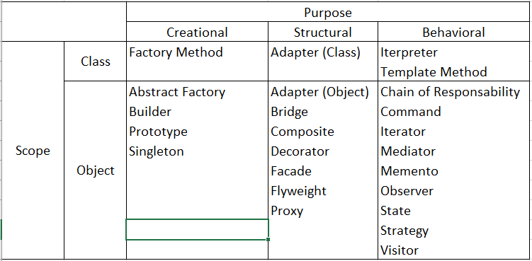

# Design Patterns 

## Don´t reinvent the wheel...

>"Each pattern describes a problem which occurs over and over again in our environment, and then describes the core of the solution to that problem, in such a way that you can use this solution a million times over, without ever doing it the same way twice" - Christoper Alexander

A design pattern is a reusable solution that can be applied to common design problems.

We can classify the design patterns by two criterias, Purpose and Scope. 
 ### Purpose**
What does the pattern do... They can be 
  - Creational: Deals with the process of the object creation
  - Structural: Concerns about the composition of the object.
  - Behavioral: Characterize how classes or objects interact and distribute responsibility.

 ### **Scope**: 
 Does it applies to Classes or Objects??
  - Class: Classes and subclasses, works with inheritance. 
  - Object: Works with objects relationships. More Dynamic!

  

In this project, we will have an example of the design patterns mentioned in Table 1.1. The separation of the folders will be by Purpose and then Scope. Each design will be described with an example of the problems that it solves and the implementation of the design in java language. 